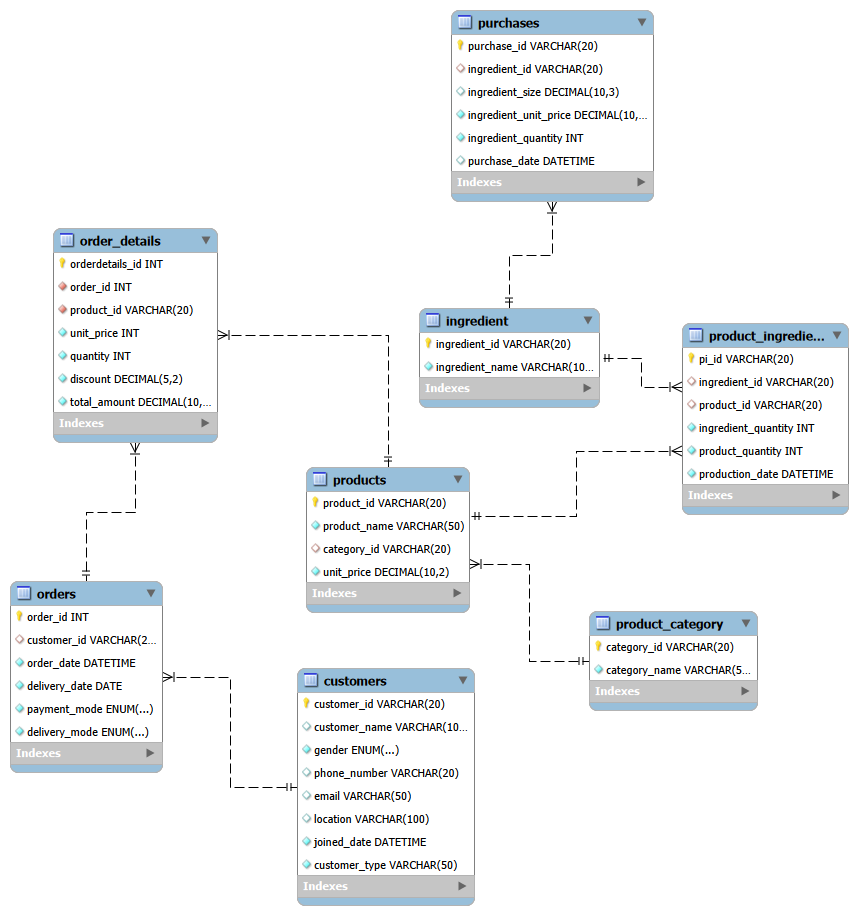

# Bakery Business Database Design 

The purpose of this project was to design a relational database for a small bakery business. 

---

## Table of Contents
1. [Project Overview](#1-project-overview)
2. [Objectives](#2-objectives)
3. [Project Scope & Tools](#3-project-scope--tools)
4. [Repository Structure](#4-repository-structure)
5. [Data Model & Schema](#6-data-model--schema)
6. [Assumptions & Limitations](#11-assumptions--limitations)
7. [Future Enhancements](#12-future-enhancements)
8. [Author](#14-author)

---

## 1. Project Overview
**Context:** A small cupcake bakery in Ghana relied on manual record-keeping and had no centralised system for storing information about customers, orders, products, ingredient purchases, or inventory usage. As the business grows, maintaining accurate records and extracting useful insights becomes increasingly difficult.

**Problem Statement:** The absence of a structured data management system limited the bakery's ability to track sales performance, monitor ingredient consumption, manage customer information, and make informed business decisions. Important operational data was scattered, inconsistent, and difficult to analyse

**Approach:** I designed a relational database in MySQL to model the bakery's core business processes. The project involved gathering business requirements, identifying key entities, defining relationships and cardinalities, creating an Entity Relationship Diagram (ERD), applying normalization principles to reduce redundancy, and implementing primary keys, foreign keys, and integrity constraints to ensure data consistency and reliability.

**Outcome:** The project resulted in a fully normalised relational database schema consisting of eight interconnected tables covering customers, orders, order details, products, product categories, ingredients, recipes, and ingredient purchases. The database provides a scalable foundation for managing business records, maintaining data quality, and supporting future reporting, inventory analysis, sales tracking, and data-driven decision making.

---

## 2. Objectives

- **Primary Objective:** Design a centralized system for business records
- **Secondary Objective 1:** Ensure the system store relevant, complete, consistent and high quality data over time
- **Secondary Objective 2:** Create a reliable data foundation for future business decisions and analysis


---

## 3. Project Scope & Tools

### Scope
| Dimension | Details |
|-----------|---------|
| **In Scope** | This project focuses on designing a relational database to support the bakery's core operations, including managing customers, products, orders, ingredients, recipes, and ingredient purchases. The database is intended to provide a structured and reliable way to store business data, maintain data integrity, and support future sales, inventory, and customer analysis. |
| **Out of Scope** | This project does not include the development of a web or mobile application, online ordering functionality, payment processing, employee management, accounting systems, or advanced inventory automation. It is limited to the design of the database schema and does not cover reporting dashboards or other business intelligence tools that may be built on top of the database in the future. |
| **Time Period** | The database is designed to store historical and ongoing business data from the date of implementation onward. It captures transactional and operational records such as orders, customer registrations, ingredient purchases, and production activities over time, enabling trend analysis and performance monitoring across days, weeks, months, and years. |
| **Granularity** | The database captures data at a transactional level of detail. Each customer order, ordered product, ingredient purchase, and product recipe is recorded as an individual record, allowing detailed analysis of sales, customer behavior, product performance, ingredient usage, and operational activities. |

### Tools & Technologies
| Category | Tool(s) Used |
|----------|-------------|
| Database Implementation & ERD | MySQL|
| Version Control | GitHub |
| Documentation | Microsoft Word |

---

## 4. Repository Structure

```
[project-root]/
│
├── queries/                
│
├── reports/                  
│
├── visuals/                 
│
├── .gitignore                 
│
├── README.md                 
│
└── project_metadata.yml               
```

---


## 5. Data Model & Schema

### Product Table

| Field Name | Data Type | Description | Example Value |
|------------|-----------|-------------|---------------|
| Product ID | VARCHAR(20) | Unique identifier for every product | P0001 |
| Product name | VARCHAR(50) | Name of the product | Cupcake |
| Category ID  | VARCHAR(20) | Category the product belongs | C001 |
| Unit price  | DECIMAL(10,2) | Price of a single product | 5.0 |

> **Key relationship:** product.category_id → category_id
> 


### Product Category Table

| Field Name | Data Type | Description | Example Value |
|------------|-----------|-------------|---------------|
| Category ID | VARCHAR(20) | Unique identifier for every category | C001 |
| Category name | VARCHAR(50) | Name of the category | Chocolate |

>


### Order Table

| Field Name | Data Type | Description | Example Value |
|------------|-----------|-------------|---------------|
| Order ID | INTEGER | Unique identifier for every order | 00001 |
| Customer ID | VARCHAR(20) | Identifier of the customer who placed the order | Cu00001 |
| Order date  | DATETIME | Date and time the order was placed | 2025-06-23 |
| Delivery date  | DATE | Date the order was or will be delivered | 2025-07-23 |
| Payment mode  | VARCHAR(20) | Mode of payment by the customer | Cash |
| Delivery mode  | VARCHAR(20) | Mode the order was delivered | Delivery |

> **Key relationship:** order.customer_id → customer_id
> 


### Order Details Table

| Field Name | Data Type | Description | Example Value |
|------------|-----------|-------------|---------------|
| Order details ID | INTEGER | Unique identifier for every order detail | OD00001 |
| Order ID | INTEGER | Identifier for the parent order | 00001 |
| Product ID | VARCHAR(20) | Identifier of the product ordered | P0001 |
| Unit price  | DECIMAL(10,2) | Price of the product at time of order (snapshot) | 5.0 |
| Quantity | INTEGER | Number of units ordered  | 100 |
| Discount | DECIMAL(5,2) | Discount applied to the product (%) | 0.1 |
| Total amount | DECIMAL(10,2) | Total amount paid for this line | 5000 |

> **Key relationship:** order_details.order_id → order_id
> 


### Customer Table

| Field Name | Data Type | Description | Example Value |
|------------|-----------|-------------|---------------|
| Customer ID | VARCHAR(20) | Unique identifier for every customer | Cu00001 |
| Customer name | VARCHAR(100) | Full name of the customer | Diana Baah |
| Gender | VARCHAR(10) | Gender of the customer | Female |
| Phone number | VARCHAR(15) | Contact number of the customer | 0552134578 |
| Email  | VARCHAR(50) | Email address of the customer | db@gmail.com |
| Location | VARCHAR(100) | Address or area of the customer | Osu |
| Joined date | DATE | Date the customer first placed an order  | 2026-06-01 |
| Customer type | VARCHAR(50) | Customer classification | Retailer |

>


### Ingredient Table

| Field Name | Data Type | Description | Example Value |
|------------|-----------|-------------|---------------|
| Ingredient ID | VARCHAR(20) | Unique identifier for every ingredient | I0001 |
| Ingredient name | VARCHAR(50) | Name of the ingredient | Flour |

> 


### Product Ingredient Table

| Field Name | Data Type | Description | Example Value |
|------------|-----------|-------------|---------------|
| Product Ingredient ID | VARCHAR(20) | Unique identifier for every recipe entry | PI0001 |
| Ingredient ID | VARCHAR(20) | Identifier for the ingredient used | I0001 |
| Product ID | VARCHAR(20) | Identifier of the product being made | P0001 |
| Ingredient quantity | INTEGER | Amount of ingredient used  | 5 |
| Product quantity | INTEGER | Number of product units produced | 20 |
| Production date | DATE | Date the production was made | 2026-07-13 |

> **Key relationship:** product_ingredient.ingredient_id → ingredient_id, product_ingredient.product_id → product_id
> 


### Purchases Table

| Field Name | Data Type | Description | Example Value |
|------------|-----------|-------------|---------------|
| Purchase ID | VARCHAR(20) | Unique identifier for every purchase record | B0001 |
| Ingredient ID | VARCHAR(20) | Identifier of the purchased ingredient | I0001 |
| Ingredient size | DECIMAL(10,3) | Size or weight of the ingredient purchased | 2.3 |
| Ingredient_unit price  | DECIMAL(10,2) | Unit price of the ingredient at time of purchase | 230|
| Ingredient quantity | INTEGER | Number of units purchased  | 2 |
| Purchase date | DATE | Date the ingredient was purchased | 2026-06-05 |

> **Key relationship:** purchases.ingredient_id → ingredient_id 


---

## ERD - Entity Relationship Diagram

Eight-table schema - customers, ingredient, order_details, orders, product_category, product_ingredient, products and purchases joined on shared IDs

---

**Table Relationships Summary:**

| Relationship | Join Key | Type |
|-------------|----------|------|
| customer → order | customer_id | One-to-Many|
| order → order details | order_id | One-to-Many|
| order details → product | product_id | Many-to-One |
| product → product category| category_id | Many-to-One |
| ingredient → product ingredient | ingredient_id | One-to-Many|
| product ingredient → product | product_id| One-to-Many|
| ingredient → purchases| ingredient_id | One-to-Many|

---


## 7. Assumptions & Limitations
### Assumptions
- This project assumes that the bakery will continue to operate as a single-location business and that all business transactions are recorded accurately and consistently.
- It assumes ingredient purchases are entered promptly to maintain accurate records.
- It is also assumed that the user of the database have basic knowledge of data entry procedures and will follow the defined data integrity constraints to ensure data quality.

### Limitations
- The project is limited to the design of the relational database and does not include the implementation of a user interface for quick data entry
- It does not support advanced features such as automated inventory updates, supplier management, employee management, online ordering, payment gateway integration or real-time reporting dashboards.

---

## 8. Future Enhancements

- [ ] Integrate the database into excel for quick data entry
- [ ] Develop a web or mobile application for easier data entry and management.
- [ ] Add sales forecasting and demand prediction using machine learning techniques.
- [ ] Support multi-branch operations by extending the database for multiple bakery locations.
- [ ] Develop interactive dashboards for sales, customer, and inventory analysis using tools such as Power BI

---

## 9. Author

**Mariama Musa**
(Data Analyst)

- 🔗 https://www.linkedin.com/in/mariama-musa/
- 💼 https://github.com/MariamaMusa
- 📧 musamariama037@gmail.com

---

*Last updated: July, 2026*
